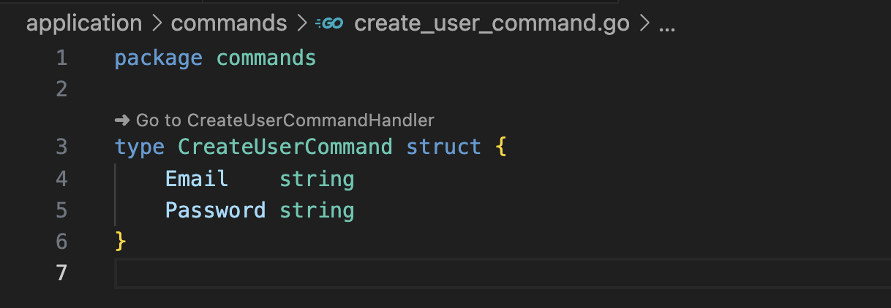
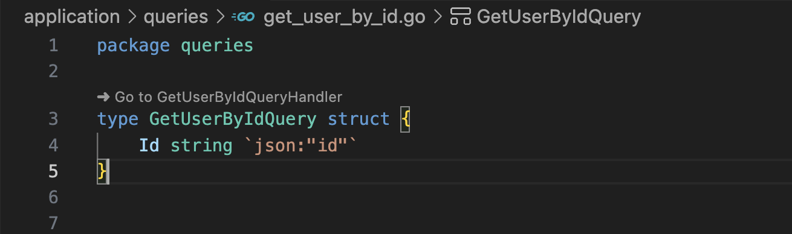

# Go Command/Query to Handler

Easy navigation between Go Commands/Queries and their corresponding Handlers.

[](https://marketplace.visualstudio.com/items?itemName=aykanferhat.go-cq-to-handler)

## Features

This extension provides easy navigation from Command and Query structures to their corresponding Handler implementations in Go projects.

- Automatically detects Command and Query structs in Go files
- Shows CodeLens links to quickly navigate to the associated Handler
- Supports both PascalCase and camelCase naming conventions
- Works across multiple files and packages

## Usage

1. Open a Go file containing Command or Query structs
2. A CodeLens link will appear above Command/Query struct definitions
3. Click the link to navigate to the corresponding Handler

### Commands Example

```go
// Command in commands/create_user.go
type CreateUserCommand struct {
    Name  string
    Email string
}

// Handler in handlers/create_user_handler.go
type CreateUserCommandHandler struct {
    repository Repository
}
```



### Queries Example

```go
// Query in queries/get_user.go
type GetUserQuery struct {
    ID string
}

// Handler in handlers/get_user_handler.go
type GetUserQueryHandler struct {
    repository Repository
}
```



## Requirements

- Visual Studio Code
- Go language files

## Extension Settings

This extension doesn't require any specific settings.

## Known Issues

None at this time.

## Release Notes

### 0.0.1

Initial release of Go Command/Query to Handler
- Added support for Command to CommandHandler navigation
- Added support for Query to QueryHandler navigation

---

## Installation

You can install this extension in several ways:

1. Search for `Go Command/Query to Handler` in VS Code Extensions view
2. [Install from VS Code Marketplace](https://marketplace.visualstudio.com/items?itemName=aykanferhat.go-cq-to-handler)
3. Use VS Code Quick Open (Ctrl+P/Cmd+P): `ext install aykanferhat.go-cq-to-handler`

**Enjoy!**
